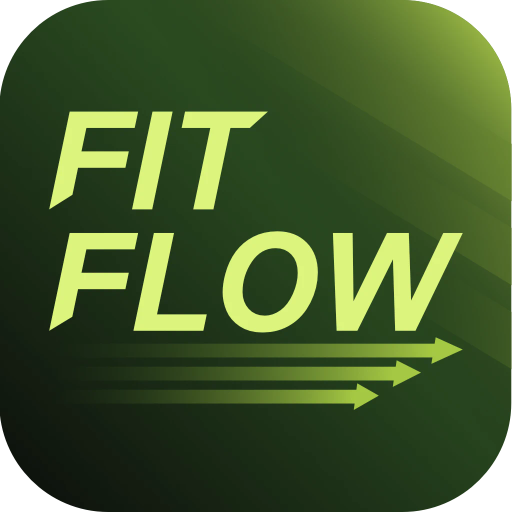

<div align="center">



# FitFlow

### Seu fluxo. Sua evolução.

**Treinos inteligentes que viciam** — um app fitness premium, mobile-first e orientado a consistência, com IA, gamificação e camada social real.

<br/>

[](#-status-do-projeto)
[](#-pwa)
[](#-licença)
[](#-contribuição)

<br/>


<br/>


</div>

<br/>

---

## 📚 Índice

- [Sobre o Projeto](#-sobre-o-projeto)
- [Status do Projeto](#-status-do-projeto)
- [Funcionalidades](#-funcionalidades)
- [Demonstração Visual](#-demonstração-visual)
- [Acesso ao Projeto](#-acesso-ao-projeto)
- [Tecnologias](#-tecnologias)
- [Arquitetura](#-arquitetura)
- [Instalação](#-instalação)
- [Roadmap](#-roadmap)
- [Contribuição](#-contribuição)
- [Autor](#-autor)
- [Licença](#-licença)

<br/>

---

## 🎯 Sobre o Projeto

**FitFlow** transforma treino em um fluxo simples, inteligente e social. A proposta do produto é reduzir a fricção entre _"abrir o app"_ e _"terminar o treino"_, ao mesmo tempo em que entrega progresso mensurável, motivação assistida por IA e uma camada social competitiva.

> **O problema:** apps de treino costumam ser planilhas glorificadas — frias, manuais e fáceis de abandonar.
>
> **A solução:** o FitFlow combina execução fluida, analytics inteligente, gamificação e social em uma experiência com cara de app nativo, pensada para uso recorrente no celular.

### Por que existe

- 📲 **Mobile-first real** — dock flutuante, navegação por swipe, safe areas e PWA instalável.
- 🤖 **IA aplicada de verdade** — gera treinos, importa fichas por foto, analisa evolução e motiva.
- 🔥 **Consistência como métrica central** — streaks, metas, medalhas e desafios entre amigos.
- 🏆 **Camada social competitiva** — ranking semanal, reações, comparações e desafios.

### Público-alvo

Pessoas que treinam e querem **organização, evolução visível e motivação contínua** — do iniciante que importa a ficha da academia ao praticante avançado que acompanha PRs e volume acumulado.

### Identidade visual

- 🌑 Dark mode por padrão com undertone esverdeado
- 🟢 Acento **neon lime** como cor assinatura
- 💎 Superfícies _glass_, gradientes premium e tipografia de display forte

<br/>

---

## 🚦 Status do Projeto

<div align="center">

🟢 **MVP ATIVO** — espinha dorsal completa de um produto fitness moderno, pronto para evoluir rumo a beta fechado e lançamento PWA.

</div>

O projeto já cobre autenticação, onboarding, treino, biblioteca, analytics, metas, medalhas, social, desafios, compartilhamento, notificações, PWA e IA.

<br/>

---

## 🔨 Funcionalidades

### 🔐 Autenticação & Onboarding
- Cadastro e login por email/senha + login social (Supabase OAuth)
- Recuperação e redefinição de senha
- Onboarding em 3 etapas (objetivo, nível, meta semanal) e `@username` público

### 📊 Dashboard Inteligente
- Saudação contextual, streak atual e próximo treino
- Volume semanal, contagem de treinos e meta mensal
- Amigos treinando ao vivo, ranking social e mensagem motivacional por IA

### 🏋️ Treinos & Execução
- Biblioteca de treinos: criar, duplicar, arquivar, restaurar e reprocessar
- Fichas (`A`, `B`, `C`…), exercícios ordenáveis, séries, reps, descanso e carga
- Execução com swipe, sugestão de carga pelo último log, timer de descanso e sessão em tempo real

### 📷 Importação por Imagem (IA)
- Importe a foto de uma planilha ou print de outro app
- IA multimodal identifica múltiplas fichas e cria os treinos automaticamente

### 📈 Analytics & Inteligência
- Performance score, evolução de carga, recordes, distribuição por grupo muscular
- Card de IA com resumo, insights, recomendações e forecast de 30 dias com ações de um toque

### 🎯 Metas & Gamificação
- Metas de frequência e corporais com histórico de medições
- Catálogo de medalhas: marcos de treino, streaks, PRs e volume acumulado

### 🤝 Social & Desafios
- Código/link de convite, amizades, ranking semanal e reações
- Desafios (`most_sessions`, `most_volume`, `most_frequency`) com leaderboard
- Comparação direta entre você e um amigo em múltiplas janelas de tempo

### 📤 Compartilhamento & Notificações
- Cards de evolução `1080x1920` para stories (download + Web Share API)
- Central de notificações + Web Push com VAPID e Service Worker

<br/>

---

## 🖼️ Demonstração Visual

<div align="center">

> 📌 _Adicione aqui screenshots e GIFs do app (dashboard, execução de treino, analytics e cards de evolução)._

<!--


-->

</div>

<br/>

---

## 🌐 Acesso ao Projeto

| Recurso | Link |
|--------|------|
| 🚀 Deploy (Vercel) | `https://seu-dominio.com` _(configurar)_ |
| 📦 Repositório | [github.com/alisoncardosoo/fit-flow](https://github.com/alisoncardosoo/fit-flow) |
| 🧪 Ambiente local | `http://localhost:8080` |

<br/>

---

## 🧰 Tecnologias

<div align="center">

### Frontend


### Backend & Dados


</div>

- **UI:** shadcn/ui + Radix UI, Recharts, Sonner, dnd-kit, Embla
- **Backend:** Supabase Auth, Postgres + RLS, Storage, Realtime e Edge Functions (IA)
- **Extras:** Web Push (VAPID + Service Worker), HTML-to-Image, Zod, React Hook Form

<br/>

---

## 🏗️ Arquitetura

```
📦 fit-flow
 ┣ 📂 src
 ┃ ┣ 📂 pages         → telas do produto (dashboard, treinos, analytics…)
 ┃ ┣ 📂 components     → blocos reutilizáveis de UI e produto
 ┃ ┣ 📂 services       → acesso a dados e agregações por domínio
 ┃ ┣ 📂 hooks          → auth, metas, realtime e utilidades
 ┃ ┣ 📂 lib            → cálculos, integrações e helpers
 ┃ ┗ 📂 integrations   → cliente Supabase e tipos
 ┣ 📂 supabase
 ┃ ┣ 📂 functions      → Edge Functions (IA, push, import, insights)
 ┃ ┗ 📂 migrations     → schema versionado + RLS
 ┗ 📂 public           → PWA manifest, ícones e service worker
```

**Edge Functions:** `motivation` · `generate-workout` · `import-workout-from-image` · `reprocess-workout` · `suggest-exercises` · `ai-insights` · `generate-exercise-image` · `send-push`

**Entidades centrais:** `profiles`, `workouts`, `routine_sheets`, `workout_exercises`, `workout_sessions`, `set_logs`, `exercises`, `goals`, `achievements`, `friendships`, `challenges`, `notifications`.

<br/>

---

## ⚙️ Instalação

### Pré-requisitos
- Node.js 18+
- npm (ou bun)
- Projeto Supabase configurado

### 1. Clonar o repositório
```bash
git clone https://github.com/alisoncardosoo/fit-flow.git
```

### 2. Entrar na pasta
```bash
cd fit-flow
```

### 3. Instalar dependências
```bash
npm install
```

### 4. Configurar variáveis de ambiente
Crie um arquivo `.env` na raiz (baseado em `.env.example`):

```env
VITE_SUPABASE_URL="https://seu-project-id.supabase.co"
VITE_SUPABASE_PUBLISHABLE_KEY="sua-anon-publishable-key"
VITE_APP_URL="http://localhost:8080"
VITE_AUTH_REDIRECT_URL="http://localhost:8080/reset-password"
```

> As Edge Functions dependem de _secrets_ no Supabase (`SUPABASE_SERVICE_ROLE_KEY`, `VAPID_PUBLIC_KEY`, `VAPID_PRIVATE_KEY`, `VAPID_SUBJECT`). Consulte o `MIGRATION_CHECKLIST.md` para o runbook completo de staging/produção.

### 5. Rodar o projeto
```bash
npm run dev
```

O Vite sobe em **`http://localhost:8080`** 🚀

### Scripts disponíveis
```bash
npm run dev          # ambiente de desenvolvimento
npm run build        # build de produção
npm run preview      # preview do build
npm run lint         # análise estática
npm test             # testes (Vitest)
npm run test:coverage # cobertura de testes
```

<br/>

---

## 🗺️ Roadmap

- [x] Autenticação, onboarding e perfil
- [x] Treinos, execução e biblioteca de exercícios
- [x] Importação de treino por imagem (IA)
- [x] Analytics, metas e medalhas
- [x] Social, desafios e compartilhamento
- [x] Notificações Web Push + PWA
- [ ] App mobile nativo
- [ ] Expansão de features premium
- [ ] Personalização avançada com IA

<br/>

---

## 🤝 Contribuição

Contribuições são muito bem-vindas! Para colaborar:

1. Faça um **fork** do projeto
2. Crie uma branch: `git checkout -b feature/minha-feature`
3. Commit suas mudanças: `git commit -m "feat: minha feature"`
4. Push para a branch: `git push origin feature/minha-feature`
5. Abra um **Pull Request**

Antes de enviar, rode `npm run lint` e `npm test` para manter a qualidade do código. Issues e sugestões também são bem-vindas.

<br/>

---

## 👤 Autor

<div align="center">


**Alison Cardoso**

[](https://github.com/alisoncardosoo)
[](https://www.linkedin.com/)

</div>

<br/>

---

## 📄 Licença

Este projeto está licenciado sob a **Licença MIT** — sinta-se livre para usar, modificar e distribuir.

```
MIT License — © 2026 Alison Cardoso
```

<br/>

---

<div align="center">

### ⚡ FitFlow — Seu fluxo. Sua evolução.

Feito com 💚 e muito treino.

⭐ **Se este projeto te inspirou, deixe uma estrela!**

</div>
